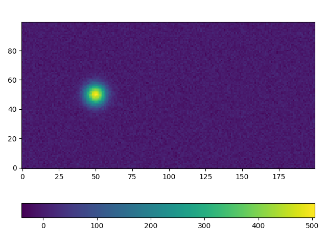
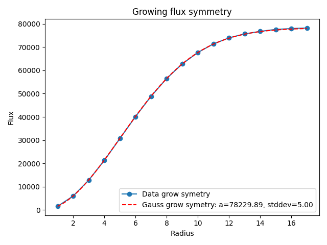
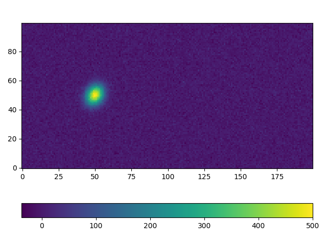
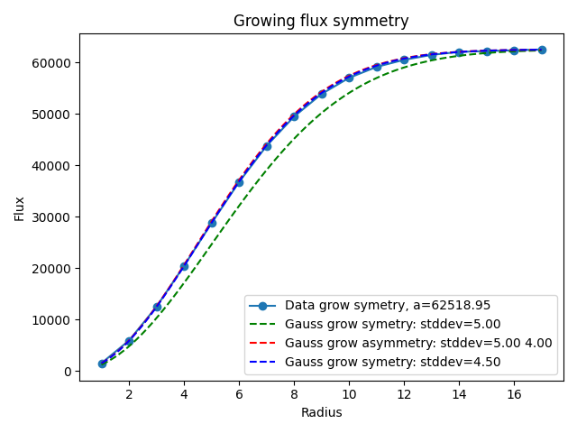

# One dimentional case

**The function is:**
$f(x) = a \exp\left(-\frac{x^2}{2\sigma^2}\right)$

<!-- **The inegral function from $0$ to radius $r$:**
$\int_0^r f(x) dx = \int_0^r a \exp\left(-\frac{x^2}{2\sigma^2}\right) dx$ -->

**The inegral of the Gaussian function**
*from $-\infty$ to $\infty$:*
$\int_{-\infty}^{\infty} a \exp\left(-\frac{x^2}{2\sigma^2}\right) dx =  a\sigma\sqrt{2\pi}$

*from $0$ to $\infty$:*
$\int_0^\infty \exp\left(-\frac{x^2}{2\sigma^2}\right) dx = a\sigma\sqrt{\frac{\pi}{2}}$

*from $0$ to radius $r$:*
$\int_0^r \exp\left(-\frac{x^2}{2\sigma^2}\right) dx = a\sigma\sqrt{\frac{\pi}{2}}\cdot \text{erf}\left(\frac{r}{\sigma\sqrt{2}}\right)$

# Two dimentional case
**The symmetrical function is:**
$f(x) = a \exp\left(-\frac{x^2 + y^2}{2\sigma^2}\right)$

**The inegral of the Gaussian function**
*from $-\infty$ to $\infty$:*
$A = \int_{-\infty}^{\infty}  a \exp\left(-\frac{x^2 + y^2}{2\sigma^2}\right) dx dy =  {2\pi}a\sigma^2$

**The growing function (integration by radius):**
$Gr = A \left[1.0 - \exp\left(-\frac{x^2 + y^2} {2 \sigma^2}\right)\right]$

**The asymmetrical function is:**
$f(x) = a \exp\left(-\frac{x^2 + y^2}{2\sigma_x\sigma_y}\right)$

**The inegral of the Gaussian function**
*from $-\infty$ to $\infty$:*
$A = \int_{-\infty}^{\infty}  a \exp\left(-\frac{x^2 + y^2}{2\sigma_x\sigma_y}\right) dx dy =  {2\pi}a\sigma_x\sigma_y$

**The growing function (integration by radius):**
$Gr = A \left[1.0 - \exp\left(-\frac{x^2 + y^2} {2 \sigma_x\sigma_y}\right)\right]$

